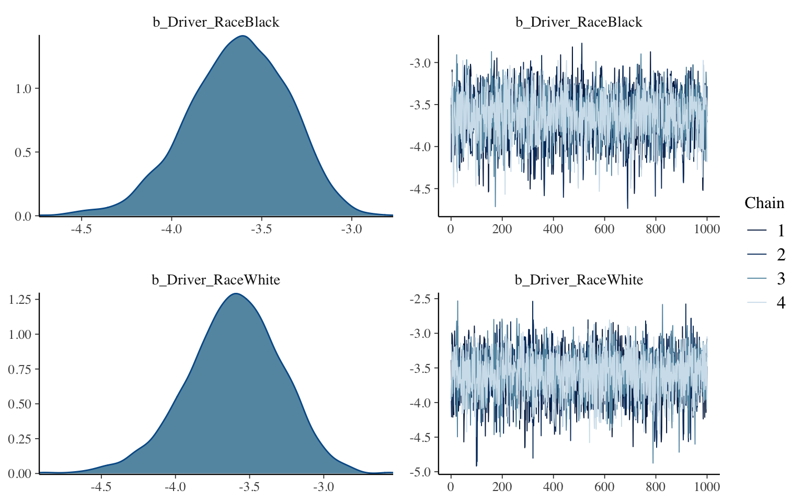
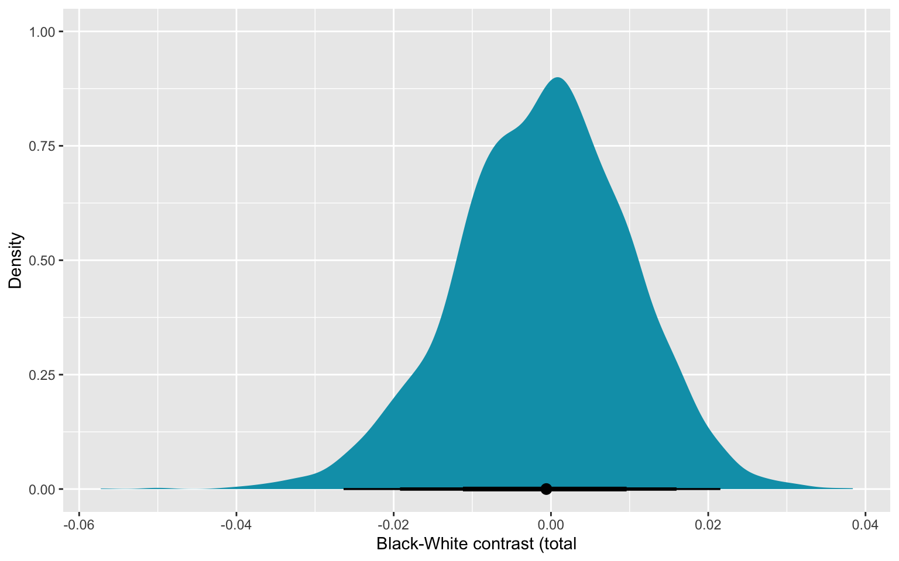
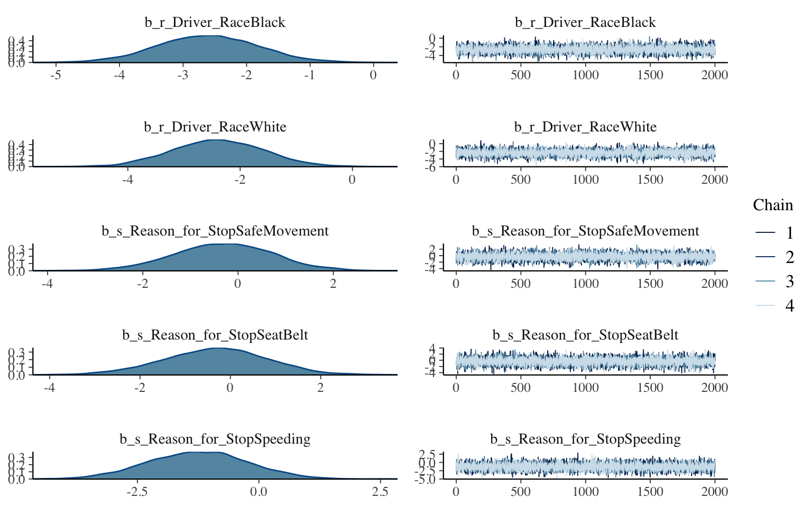
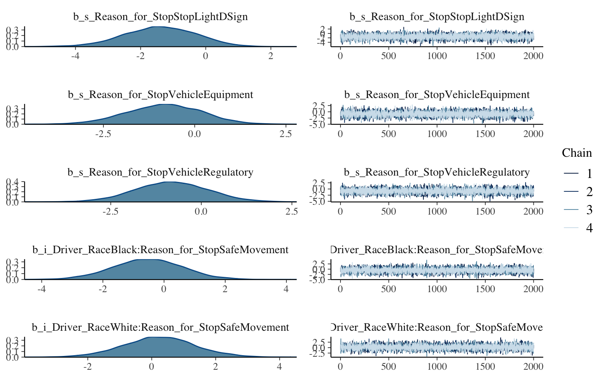
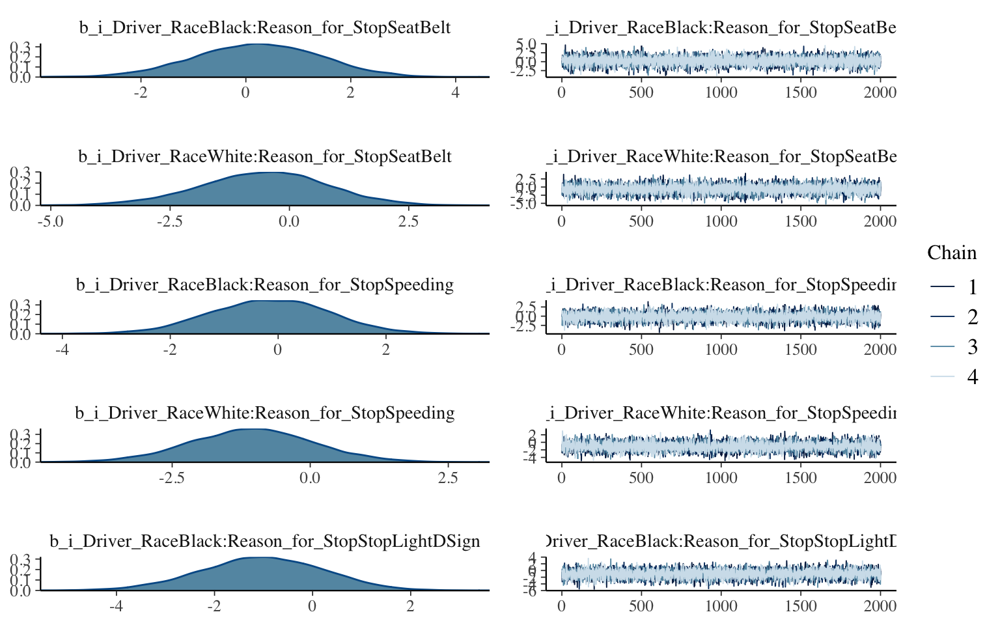
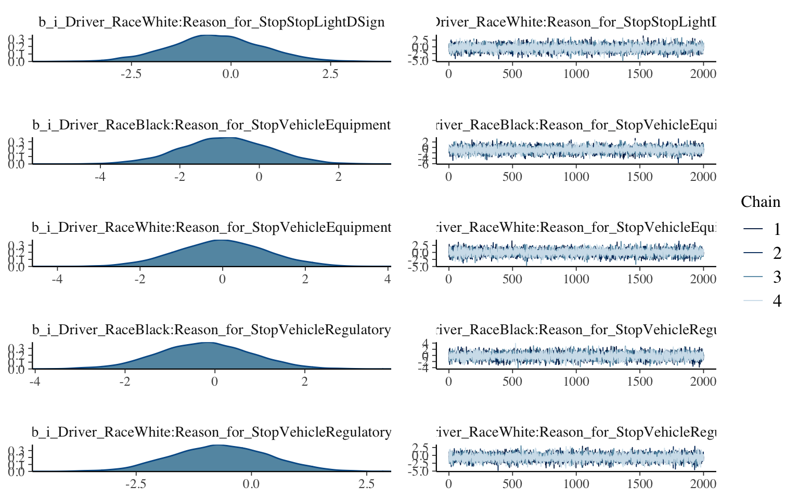
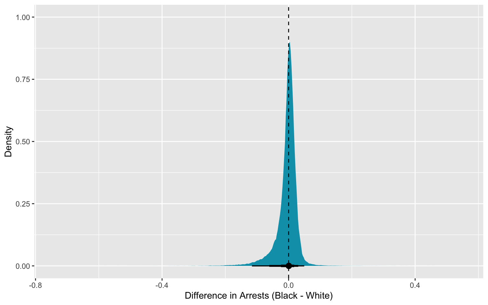
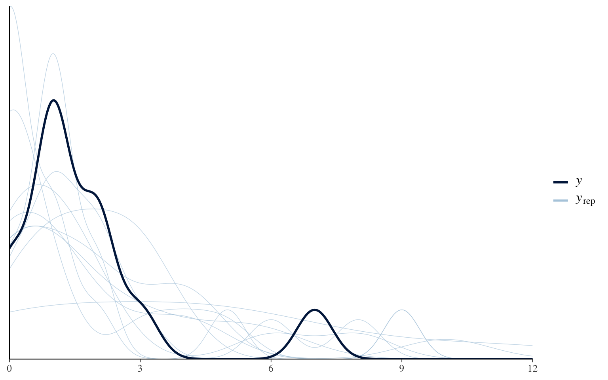

## 0. Problem: Total Effect of Race on CMPD Arrests

Load the data and aggregate for counts.

``` r
library(tidyverse)
```

    ── Attaching packages ─────────────────────────────────────── tidyverse 1.3.1 ──

    ✔ ggplot2 3.3.5     ✔ purrr   0.3.4
    ✔ tibble  3.1.4     ✔ dplyr   1.0.7
    ✔ tidyr   1.1.3     ✔ stringr 1.4.0
    ✔ readr   2.0.1     ✔ forcats 0.5.1

    ── Conflicts ────────────────────────────────────────── tidyverse_conflicts() ──
    ✖ dplyr::filter() masks stats::filter()
    ✖ dplyr::lag()    masks stats::lag()

``` r
df <- read_csv("Officer_Traffic_Stops.csv") %>%
  mutate(arrest = if_else(Result_of_Stop == "Arrest", 1L, 0L)) %>%
  sample_n(size=1000) %>%
  filter(Driver_Race %in% c("White","Black")) %>%
  filter(Reason_for_Stop %in% c("Vehicle Regulatory","Speeding","SeatBelt","Vehicle Equipment","Stop Light/Sign","Safe Movement"))
```

    Rows: 68488 Columns: 17

    ── Column specification ────────────────────────────────────────────────────────
    Delimiter: ","
    chr  (12): Month_of_Stop, Reason_for_Stop, Officer_Race, Officer_Gender, Dri...
    dbl   (3): Officer_Years_of_Service, Driver_Age, ObjectID
    dttm  (2): CreationDate, EditDate


    ℹ Use `spec()` to retrieve the full column specification for this data.
    ℹ Specify the column types or set `show_col_types = FALSE` to quiet this message.

``` r
head(df)
```

    # A tibble: 6 × 18
      Month_of_Stop Reason_for_Stop    Officer_Race  Officer_Gender Officer_Years_o…
      <chr>         <chr>              <chr>         <chr>                     <dbl>
    1 2016/07       Vehicle Equipment  White         Male                          1
    2 2017/04       Speeding           Black/Africa… Male                          7
    3 2017/10       Speeding           Black/Africa… Male                         16
    4 2017/08       Vehicle Equipment  White         Male                         19
    5 2017/01       Speeding           Asian / Paci… Male                          7
    6 2016/10       Vehicle Regulatory White         Male                          8
    # … with 13 more variables: Driver_Race <chr>, Driver_Ethnicity <chr>,
    #   Driver_Gender <chr>, Driver_Age <dbl>, Was_a_Search_Conducted <chr>,
    #   Result_of_Stop <chr>, CMPD_Division <chr>, ObjectID <dbl>,
    #   CreationDate <dttm>, Creator <chr>, EditDate <dttm>, Editor <chr>,
    #   arrest <int>

``` r
df2 <- df %>%
  group_by(Driver_Race,Reason_for_Stop) %>%
  summarise(stops = n(), arrests = sum(arrest))
```

    `summarise()` has grouped output by 'Driver_Race'. You can override using the `.groups` argument.

``` r
df2
```

    # A tibble: 12 × 4
    # Groups:   Driver_Race [2]
       Driver_Race Reason_for_Stop    stops arrests
       <chr>       <chr>              <int>   <int>
     1 Black       Safe Movement         34       1
     2 Black       SeatBelt               4       0
     3 Black       Speeding             114       0
     4 Black       Stop Light/Sign       45       1
     5 Black       Vehicle Equipment     72       4
     6 Black       Vehicle Regulatory   251       3
     7 White       Safe Movement         18       0
     8 White       SeatBelt               3       0
     9 White       Speeding             149       0
    10 White       Stop Light/Sign       48       0
    11 White       Vehicle Equipment     41       0
    12 White       Vehicle Regulatory   117       0

## 1. Scientific Model

For our initial model, I used [daggity.net](http://www.dagitty.net/) to
specify my Directed Acyclic Graph, or DAG. This outlines my prior
assumptions of the causality paths for these variables.

``` r
library(dagitty)

g <- dagitty('dag {
bb="0,0,1,1"
Arrest [outcome,pos="0.641,0.606"]
Race [exposure,pos="0.207,0.608"]
StopReason [pos="0.465,0.242"]
Race -> Arrest
Race -> StopReason
StopReason -> Arrest
}
')
plot(g)
```


## 2. Statistical Model

Our objective is to find the **total** causal effect of Race on arrests.
With our specified DAG, we can find the corrrect adjustment set we find
there is no need to control (stratify) by `StopReason` to identify the
total causal effect of Race on Arrests.

I can use a Binomial response where the trials will be stops and our
counts are for arrests.

``` r
library(brms)
```

    Loading required package: Rcpp

    Loading 'brms' package (version 2.16.1). Useful instructions
    can be found by typing help('brms'). A more detailed introduction
    to the package is available through vignette('brms_overview').


    Attaching package: 'brms'

    The following object is masked from 'package:stats':

        ar

``` r
m1 <- brm(
  arrests | trials(stops) ~ 0 + Driver_Race, 
  family = binomial("logit"), 
  prior = set_prior("normal(0,1.5)", class = "b"), 
  data = df2, chains = 4, cores = parallel::detectCores(),
  file = "models/m1.rds" # cache model (can be removed)  
)

summary(m1)
```

     Family: binomial 
      Links: mu = logit 
    Formula: arrests | trials(stops) ~ 0 + Driver_Race 
       Data: df2 (Number of observations: 12) 
      Draws: 4 chains, each with iter = 2000; warmup = 1000; thin = 1;
             total post-warmup draws = 4000

    Population-Level Effects: 
                     Estimate Est.Error l-95% CI u-95% CI Rhat Bulk_ESS Tail_ESS
    Driver_RaceBlack    -3.63      0.28    -4.21    -3.14 1.01     2699     2409
    Driver_RaceWhite    -3.61      0.32    -4.28    -3.02 1.00     3368     2365

    Draws were sampled using sampling(NUTS). For each parameter, Bulk_ESS
    and Tail_ESS are effective sample size measures, and Rhat is the potential
    scale reduction factor on split chains (at convergence, Rhat = 1).

## 3. Model Diagnostics

Our parameter Rhat's are near 1, which would reflect good model
convergence as we can see in the trace plots.

``` r
plot(m1)
```



## 4. Posterior Samples and Contrasts

I then used `tidybayes` to get posterior samples with contrasts.

``` r
library(tidybayes)
```


    Attaching package: 'tidybayes'

    The following objects are masked from 'package:brms':

        dstudent_t, pstudent_t, qstudent_t, rstudent_t

``` r
posterior_draws <- m1 %>%
  spread_draws(b_Driver_RaceWhite,b_Driver_RaceBlack) %>% # sample/draw posteriors
  mutate(Contrast = inv_logit_scaled(b_Driver_RaceBlack) - inv_logit_scaled(b_Driver_RaceWhite))


posterior_draws %>%
  ggplot(aes(x = Contrast)) +
  stat_halfeye(.width = c(0.67, 0.89, 0.97), fill = "#009FB7") +
  labs(x = "Black-White contrast (total", y = "Density")
```



## 5. Posterior Predictive Checks

To measure against model fit, we can use `pp_check` to examine the
model's predictions against the actual data.

``` r
bayesplot::pp_check(m1)
```

    Using 10 posterior draws for ppc type 'dens_overlay' by default.


Overall, the model fits pretty well. From this very naive model, we find
some causal effects of race on arrests. But assuming the DAG above, what
if we want to examine only the **direct** effect of Race?

## 2B. Statistical Model

``` r
m2 <- brm(bf(arrests | trials(stops) ~ r + s + i,
               r ~ 0 + Driver_Race,
               s ~ 0 + Reason_for_Stop,
               i ~ 0 + Driver_Race:Reason_for_Stop,
               nl = TRUE), data = df2, family = binomial,
            prior = c(prior(normal(0, 1.5), nlpar = r),
                      prior(normal(0, 1.5), nlpar = s),
                      prior(normal(0, 1.5), nlpar = i)),
            iter = 4000, warmup = 2000, chains = 4, cores = 4, seed = 1234,
            file = "models/m2.rds" # cache model (can be removed)  
          )

summary(m2)
```

     Family: binomial 
      Links: mu = logit 
    Formula: arrests | trials(stops) ~ r + s + i 
             r ~ 0 + Driver_Race
             s ~ 0 + Reason_for_Stop
             i ~ 0 + Driver_Race:Reason_for_Stop
       Data: df2 (Number of observations: 12) 
      Draws: 4 chains, each with iter = 4000; warmup = 2000; thin = 1;
             total post-warmup draws = 8000

    Population-Level Effects: 
                                                        Estimate Est.Error l-95% CI
    r_Driver_RaceBlack                                     -2.61      0.79    -4.16
    r_Driver_RaceWhite                                     -2.40      0.81    -3.96
    s_Reason_for_StopSafeMovement                          -0.31      1.04    -2.37
    s_Reason_for_StopSeatBelt                              -0.33      1.15    -2.65
    s_Reason_for_StopSpeeding                              -1.25      1.02    -3.25
    s_Reason_for_StopStopLightDSign                        -1.40      1.09    -3.62
    s_Reason_for_StopVehicleEquipment                      -0.84      1.03    -2.88
    s_Reason_for_StopVehicleRegulatory                     -0.82      1.00    -2.80
    i_Driver_RaceBlack:Reason_for_StopSafeMovement         -0.53      1.13    -2.80
    i_Driver_RaceWhite:Reason_for_StopSafeMovement          0.24      1.12    -1.98
    i_Driver_RaceBlack:Reason_for_StopSeatBelt              0.22      1.19    -2.14
    i_Driver_RaceWhite:Reason_for_StopSeatBelt             -0.55      1.33    -3.26
    i_Driver_RaceBlack:Reason_for_StopSpeeding             -0.16      1.10    -2.32
    i_Driver_RaceWhite:Reason_for_StopSpeeding             -1.05      1.11    -3.27
    i_Driver_RaceBlack:Reason_for_StopStopLightDSign       -1.03      1.24    -3.50
    i_Driver_RaceWhite:Reason_for_StopStopLightDSign       -0.38      1.16    -2.69
    i_Driver_RaceBlack:Reason_for_StopVehicleEquipment     -0.85      1.11    -3.04
    i_Driver_RaceWhite:Reason_for_StopVehicleEquipment     -0.01      1.09    -2.16
    i_Driver_RaceBlack:Reason_for_StopVehicleRegulatory    -0.23      1.04    -2.30
    i_Driver_RaceWhite:Reason_for_StopVehicleRegulatory    -0.67      1.05    -2.69
                                                        u-95% CI Rhat Bulk_ESS
    r_Driver_RaceBlack                                     -1.05 1.00     7424
    r_Driver_RaceWhite                                     -0.80 1.00     7414
    s_Reason_for_StopSafeMovement                           1.73 1.00     8460
    s_Reason_for_StopSeatBelt                               1.88 1.00     9342
    s_Reason_for_StopSpeeding                               0.72 1.00     8006
    s_Reason_for_StopStopLightDSign                         0.66 1.00     8453
    s_Reason_for_StopVehicleEquipment                       1.12 1.00     8550
    s_Reason_for_StopVehicleRegulatory                      1.17 1.00     7339
    i_Driver_RaceBlack:Reason_for_StopSafeMovement          1.70 1.00    10086
    i_Driver_RaceWhite:Reason_for_StopSafeMovement          2.47 1.00     8732
    i_Driver_RaceBlack:Reason_for_StopSeatBelt              2.50 1.00    10160
    i_Driver_RaceWhite:Reason_for_StopSeatBelt              2.01 1.00    10511
    i_Driver_RaceBlack:Reason_for_StopSpeeding              1.97 1.00     9407
    i_Driver_RaceWhite:Reason_for_StopSpeeding              1.14 1.00     8883
    i_Driver_RaceBlack:Reason_for_StopStopLightDSign        1.32 1.00    10541
    i_Driver_RaceWhite:Reason_for_StopStopLightDSign        1.92 1.00     9215
    i_Driver_RaceBlack:Reason_for_StopVehicleEquipment      1.32 1.00     9170
    i_Driver_RaceWhite:Reason_for_StopVehicleEquipment      2.15 1.00     9137
    i_Driver_RaceBlack:Reason_for_StopVehicleRegulatory     1.80 1.00     7822
    i_Driver_RaceWhite:Reason_for_StopVehicleRegulatory     1.36 1.00     7603
                                                        Tail_ESS
    r_Driver_RaceBlack                                      5715
    r_Driver_RaceWhite                                      5958
    s_Reason_for_StopSafeMovement                           5888
    s_Reason_for_StopSeatBelt                               6703
    s_Reason_for_StopSpeeding                               6223
    s_Reason_for_StopStopLightDSign                         5753
    s_Reason_for_StopVehicleEquipment                       5613
    s_Reason_for_StopVehicleRegulatory                      5468
    i_Driver_RaceBlack:Reason_for_StopSafeMovement          6163
    i_Driver_RaceWhite:Reason_for_StopSafeMovement          5978
    i_Driver_RaceBlack:Reason_for_StopSeatBelt              6325
    i_Driver_RaceWhite:Reason_for_StopSeatBelt              5770
    i_Driver_RaceBlack:Reason_for_StopSpeeding              6401
    i_Driver_RaceWhite:Reason_for_StopSpeeding              5715
    i_Driver_RaceBlack:Reason_for_StopStopLightDSign        6260
    i_Driver_RaceWhite:Reason_for_StopStopLightDSign        6483
    i_Driver_RaceBlack:Reason_for_StopVehicleEquipment      6130
    i_Driver_RaceWhite:Reason_for_StopVehicleEquipment      6197
    i_Driver_RaceBlack:Reason_for_StopVehicleRegulatory     5453
    i_Driver_RaceWhite:Reason_for_StopVehicleRegulatory     5478

    Draws were sampled using sampling(NUTS). For each parameter, Bulk_ESS
    and Tail_ESS are effective sample size measures, and Rhat is the potential
    scale reduction factor on split chains (at convergence, Rhat = 1).

## 3B. Model Diagnostics

``` r
plot(m2)
```









## 4B. Posterior Samples and Contrasts

``` r
stops_per_reason <- df2 %>% 
  group_by(Reason_for_Stop) %>% 
  summarize(stops = sum(stops))

# simulate as if all arrests are from black
black_dat <- stops_per_reason %>% 
  mutate(Driver_Race = "Black") %>% 
  uncount(stops) %>% 
  mutate(stops = 1L)

# simulate as if all arrests are from white
white_dat <- stops_per_reason %>% 
  mutate(Driver_Race = "White") %>% 
  uncount(stops) %>% 
  mutate(stops = 1L)

marg_eff <- bind_rows(add_epred_draws(black_dat, m2),
                      add_epred_draws(white_dat, m2)) %>% 
  pivot_wider(names_from = "Driver_Race", values_from = ".epred") %>% 
  mutate(diff = Black - White)
```

``` r
ggplot(marg_eff, aes(x = diff)) +
  stat_halfeye(.width = c(0.67, 0.89, 0.97), fill = "#009FB7") +
  geom_vline(xintercept = 0, linetype = "dashed") +
  labs(x = "Difference in Arrests (Black - White)", y = "Density")
```



## 5B. Posterior Predictive Checks

Let's examine the model fit.

``` r
bayesplot::pp_check(m2)
```

    Using 10 posterior draws for ppc type 'dens_overlay' by default.



## 6. Model Comparison

Given our DAG, each model provides a different type of causal effect
(partial vs. total). Let's consider model fit using WAIC/PSIS sampling.

``` r
(waic1 <- waic(m1))
```

    Warning: 
    1 (8.3%) p_waic estimates greater than 0.4. We recommend trying loo instead.


    Computed from 4000 by 12 log-likelihood matrix

              Estimate  SE
    elpd_waic    -18.6 2.5
    p_waic         1.3 0.5
    waic          37.2 4.9

    1 (8.3%) p_waic estimates greater than 0.4. We recommend trying loo instead. 

``` r
(waic2 <- waic(m2))
```

    Warning: 
    4 (33.3%) p_waic estimates greater than 0.4. We recommend trying loo instead.


    Computed from 8000 by 12 log-likelihood matrix

              Estimate  SE
    elpd_waic    -20.0 2.2
    p_waic         4.2 0.3
    waic          40.1 4.4

    4 (33.3%) p_waic estimates greater than 0.4. We recommend trying loo instead. 

``` r
loo_compare(waic1, waic2) 
```

       elpd_diff se_diff
    m1  0.0       0.0   
    m2 -1.4       1.7   

## Final Analysis

``` r
library(ggrepel)

df2 %>% 
  group_by(Reason_for_Stop) %>% 
  summarize(white = sum(stops[which(Driver_Race == "White")]),
            black = sum(stops[which(Driver_Race == "Black")]),
            total_stops = sum(stops),
            total_arrests = sum(arrests)) %>% 
  mutate(white_pct = white / sum(white),
         black_pct = black / sum(black),
         arrest_pct = total_arrests / total_stops) %>% 
  ggplot(aes(x = white_pct, y = black_pct)) +
  geom_point(aes(size = arrest_pct, color = abs(white_pct - black_pct) > 0.01)) +
  geom_abline(intercept = 0, slope = 1, linetype = "dashed") +
  geom_label_repel(data = ~filter(.x, abs(white_pct - black_pct) > 0.01),
                   aes(label = Reason_for_Stop),
                   max.overlaps = Inf, nudge_y = 0.03) +
  scale_size(breaks = seq(0.1, 0.3, by = 0.04)) +
  scale_color_manual(values = c("black", "#009FB7")) +
  guides(color = "none") +
  coord_equal() +
  labs(x = "White Arrest Rate", y = "Black Arrest Rate",
       size = "Arrest Rate") +
  theme(legend.position = "right")
```


